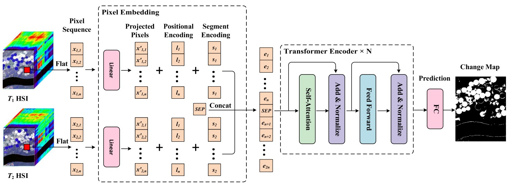

# CDFormer: A Hyperspectral Image Change Detection Method Based on Transformer Encoders --IEEE Geoscience and Remote Sensing Letters

Code for the paper ["CDFormer: A Hyperspectral Image Change Detection Method Based on Transformer Encoders"](https://ieeexplore.ieee.org/document/9930108).  More specifically, it is detailed as follow. 



## Data

The datasets can be found in https://rslab.ut.ac.ir/data

## Citation

Please kindly cite the papers if this code is useful and helpful for your research.

J. Ding, X. Li and L. Zhao, "CDFormer: A Hyperspectral Image Change Detection Method Based on Transformer Encoders," in IEEE Geoscience and Remote Sensing Letters, vol. 19, pp. 1-5, 2022, Art no. 6015405, doi: 10.1109/LGRS.2022.3216878.

```tex
@article{ding2022cdformer,
  title = {{{CDFormer}}: {{A Hyperspectral Image Change Detection Method Based}} on {{Transformer Encoders}}},
  author = {Ding, Jigang and Li, Xiaorun and Zhao, Liaoying},
  year = {2022},
  journal = {IEEE Geosci. Remote Sens. Lett.},
  volume = {19},
  pages = {1--5},
  doi = {10.1109/LGRS.2022.3216878}
}
```

